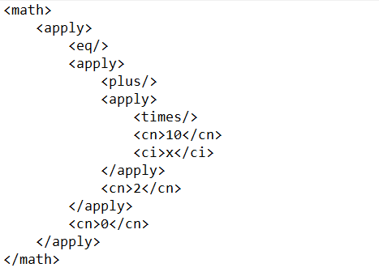
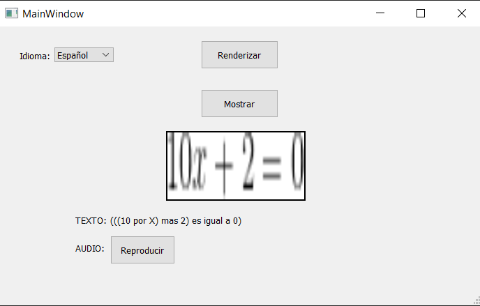
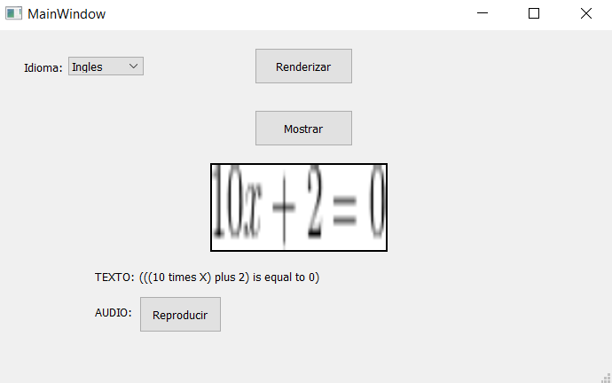

# CMathML-to-Text
Program to improve the learning of mathematical analysis in blind and visually impaired students.

This project is oriented to facilitate the learning of mathematical analysis of blind people, and contribute to their academic training. The code developed by @lthurr in his repository textoes, which uses as input mathematical equations in CMathML files and transforms them to text, is used as a base. Among the modifications that were made in this work, include the use of a TeX engine on the computer to not depend on any online service that can fail at any time, also implements a graphical interface to render, display the image, display the text and play the audio of the text read from the equation, also has the option to be in several languages (Spanish, English and Portuguese). The folder has several examples that can be used to understand its operation.

As an example we would have the equation 10x+2=0. Then the equation and the input to the program would be the following:

The output in Spanish would be the following:

The output in English would be the following:

And finally, the output in Portuguese would be the following:

